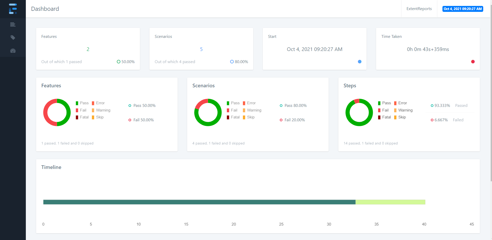
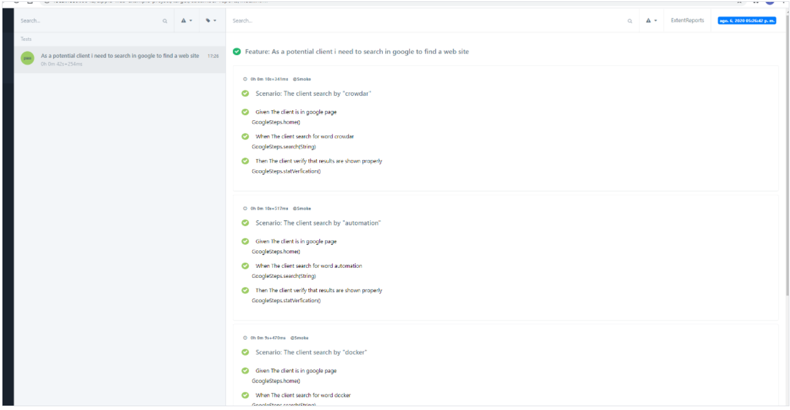
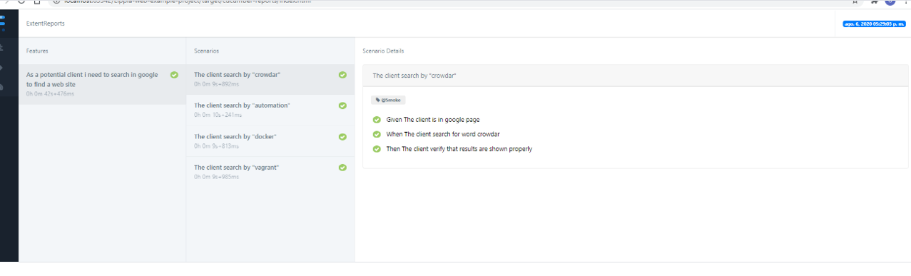
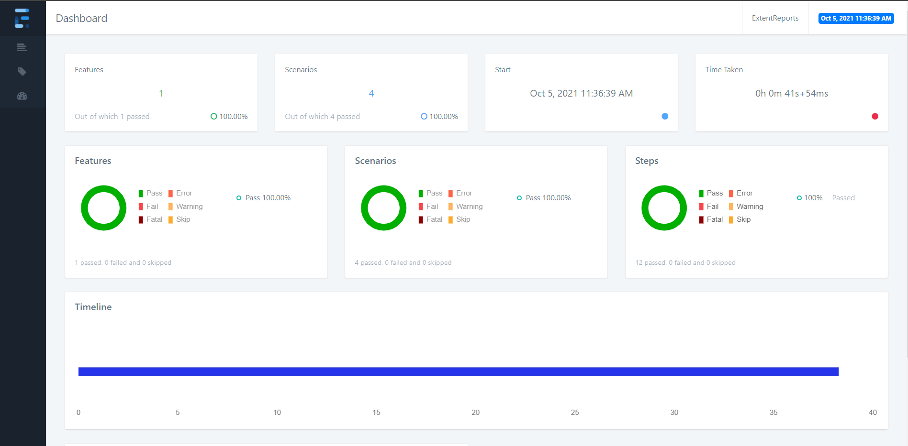

# Lippia Web sample project

<!--## Architecture


- Through Spring rest client, Lippia supports web tests, being able to reuse definitions from other tests as well as including this behavior in tests of other types such as mobile, API, etc.

- We believe that the best approach to automate testing from conception to deployment is to use BDD (Behaviour Driven Development) to include not just Developers, but Testers and Business Analysts, and that is why...   

The scenarios can be written using BDD methodology. 
    
    Given as a precondition
    
    When as actions
    
    Then as validations
    
    
On each declared step you can insert the calls defined from service classes -->

## System Requirements: 
+ jdk: https://docs.oracle.com/en/java/javase/index.html 
+ maven: https://maven.apache.org/download.cgi 
+ git client: https://www.atlassian.com/git/tutorials/install-git 
+ docker 18.09+: https://docs.docker.com/install/linux/docker-ce/ubuntu/  _OPTIONAL_ 
+ docker compose 1.24+: https://docs.docker.com/compose/install/ _OPTIONAL_ 


"This project is licensed under the terms of the MIT license."

# Update Version Lippia 3

## Main Features: 
- Added multiple reports of extent reports
- Added the feature to handle the chrome options by a json file
- Include project type properties that allows to decide which library would need for the project
- Added the dependency for lippia report server 
- Cucumber version updated


# Getting started

This project has the intention of showing a way practically how to use Lippia Automation Framework to build automated tests by using Gherkin and Page-Object Model pattern.  
This sample project includes the required components as binaries, docker containers and configuration files to simply download and run a set of sample tests in your local computer, using the Lippia container stack described bellow.


- ## Running with Maven

  + ### First Step

    + Download and unzip the source repository for this guide, or clone it using Git:   
    ```
    $ git clone https://gitlab.com/lippia/products/samples/lippia-web-sample-project.git
    ```

    + Go to root directory:   
    ```
    $ cd lippia-web-sample-project
    ```   

  + ### Second Step

    If you want to run tests locally, you need maven as a minimum requirement   
    + Make sure you have installed maven correctly   

    ```
    $ mvn --version

      OUTPUT:
        Apache Maven 3.8.2 (ea98e05a04480131370aa0c110b8c54cf726c06f)
        Maven home: /opt/apache-maven-3.8.2
        Java version: 13.0.5.1, vendor: Debian, runtime: /usr/lib/jvm/java-13-openjdk-amd64
        Default locale: en_US, platform encoding: UTF-8
        OS name: "linux", version: "5.10.0-6parrot1-amd64", arch: "amd64", family: "unix"
    ```

    If you don't see a similar output:
    + Make sure you have the maven path configured   
    #### Linux user
    ```
    $ grep -Ew '(.*)(M2_HOME)' ~/.bashrc

      OUTPUT:
        M2_HOME=/opt/apache-maven-3.8.2
        PATH=$PATH:$M2_HOME/bin
    ```   
    #### Windows user
    ```
    $ set

      OUTPUT:
        M2_HOME=C:\Program Files\apache-maven-3.8.2
        PATH=%PATH%;%M2_HOME%\bin;
    ```

  + ### Third Step

    + To run the tests with maven, we must execute the following command:   

    ```
    $ mvn clean test
    ```

- ## Running with Docker

    ## Docker stack

    The following project includes the basic Docker Lippia Containers to run this Web sample project. You can choose the code from your favourite IDE, to run from console or from Jenkins by using the Docker Stack.

    Note that if you don't have installed docker & docker-compose, [Click here](#system-requirements)

    + ### First Step
      - Make sure you have installed docker-engine correctly   
      ```
      $ docker --version
        OUTPUT:
          Docker version 19.03.15, build 99e3ed8919
      ```   
    
    + ### Second Step
      - Make sure you have installed docker-compose correctly
      ```
      $ docker-compose --version
        OUTPUT:
          docker-compose version 1.29.2, build 5becea4c
      ```   

    + ### Third Step   
        #### Execute tests in you local machine   
        
        - Go to root project folder and you will find a pom.xml file   
        ```
        $ cd lippia-web-sample-project
        ```   
        
        - Run the following command: 

        In case the command "**sudo**" is not used in Windows.

        ```
        $ sudo docker-compose up --abort-on-container-exit --exit-code-from lippia_zalenium

          OUTPUT:
            Creating network "lippia-web-sample-project_default" with the default driver
            Creating lippia-web-sample-project_zalenium_1 ... done
            Creating lippia-web-sample-project_lippia_zalenium_1 ... done
            Attaching to lippia-web-sample-project_zalenium_1, lippia-web-sample-project_lippia_zalenium_1
            ...
        ```   
    

# Reports[](url)

We believe that the reports should express the results of our tests in the most legible, detailed and pleasant way possible, so that in this way, our clients have at their disposal a report on the operation and behavior of their product, as well as the performance of the team. That is why Lippia, in addition to supporting the integration with **ExtentReport**, provides a **ReportServer** for each client.   
Next, we will see the structure of the project and from where we can access them.

### Reports are generated in the folder called **target**, which will be generated once the execution of the test suite is finished.   
Note that the following structure is part of the report generated with ExtentReport library.
```
├── lippia-web-sample-project
|   ├── docs
|   |   └── ...
|   ├── src
|   |   └── ...
│   ├── target
│   |   └── reports
|   |       └── index.html
|   └── ...
```

<!--
### Graphic example 
```
~@ignore for now
```  

-->

## Multiple reports templates:
 - With this version of Lippia the user has the possibility to choose which kind of template for html reports is the best for the project requirements.
   The user only needs to turn on the flag in the extent.properties file located in src/test/resources.
   
   
### Some examples of this are
   
#### Avenstack template:   
   
   
#### BDD template:   
   
   
#### Cards template:   
   


## Project structure

A typical Lippia Test Automation project usually looks like this 

```
  .
├── main
│     ├── java
│     │     └── lippia
│     │           └──web
│     │               ├── contants
│     │               │       └── GoogleConstants
│     │               ├── reporters 
│     │               │       └──CucumberReporter
│     │               ├── services        
│     │               │       ├── GoogleHomeService
│     │               │       └── GoogleSearchResultService
│     │               └── steps     
│     │                       └── GoogleSearchSteps
│     └── resources
│           └── browsers
│                 ├── config.properties
│                 ├── cucumber.properties
│                 ├── extent.properties
│                 └── log4j.properties
├── test
│     └── resources
│             └── web
│                   └──features
│                         └── googleSearch.feature
```


Folder's description:

|Path   |Description     |
|-------|----------------|
|main\java\\...\contants\\\*.java|Folder with all the **web elements' locators** matching steps with java code|
|main\java\\...\services\\\*.java|Folder with all the **PageObjects** matching steps with java code|
|main\java\\...\steps\\\*Steps.java|Folder with all the **steps** which match with Gherkin Test Scenarios |
|test\resources\web.features\\\*.feature|Folder with all the **feature files** containing **Test Scenarios** and **Sample Data** |
|main\resources|Folder with all configuration needed to run Lippia |

In this example, *GoogleHomeService* is the first web page the framework will interact with. The **steps** defined in *GoogleSearchSteps* to execute the *Test Scenarios* defined in Gherkin language. 

|File   | Description    |
|-------|----------------|
|GoogleConstants    | Constants : Define web elements' locators. And between each element in the webpage *GoogleHomeService & GoogleSearchResultService * you want to interact with. |
|GoogleHomeService    | Define base URL to navigate. And between each element in the webpage *GoogleHomeService * you want to interact with. You need to add one new file for each page you want to navigate in your tests. |
|GoogleSearchResultService.java   | Where making assertion and getting results.   |
|GoogleSteps.java   | StepObject: Code to support the behaviour of each **step** coded into the feature files for the *GoogleHomeService & GoogleSearchResultService* web page. This code executes the interaction between the Framework and the web application, and match the steps with the code who run interactions. |
|googleSearch.feature| Feature file: Definition of the **Test Scenarios** with all the **steps** written in Cucumber format (http)|

## Constants
***
```
public class GoogleConstants {

    public static final String INPUT_SEARCH_XPATH = "xpath://input[@class='gLFyf gsfi']";
    public static final String SEARCH_BUTTON_NAME = "name:btnK";
    public static final String STATS_ID = "id:rcnt";


}
```


## Services
***
```
public class GoogleHomeService extends ActionManager {

    public static void navegarWeb(){
        navigateTo(PropertyManager.getProperty("web.base.url"));
    }

    public static void enterSearchCriteria(String text) {
        setInput(GoogleConstants.INPUT_SEARCH_XPATH, text);
    }

    public static void clickSearchButton() {
        click(GoogleConstants.SEARCH_BUTTON_NAME);
    }
}

public class GoogleSearchResultService extends ActionManager {

    private static WebElement stats() {
        return getElement(GoogleConstants.STATS_ID);
    }

    public static String getStats() {
        return stats().getText();
    }

    public static void verifyResults(){
        Assert.assertFalse(getStats().isEmpty());
    }
}

```


## Step Object   
***
    
```
public class GoogleSearchSteps extends PageSteps {

    @Given("The client is in google page")
    public void home() {
        GoogleHomeService.navegarWeb();
    }

    @When("^The client search for word (.*)$")
    public void search(String criteria) {
        GoogleHomeService.enterSearchCriteria(criteria);
        GoogleHomeService.clickSearchButton();
    }

    @Then("The client verify that results are shown properly")
    public void statVerfication() {
        GoogleSearchResultService.verifyResults();

    }

}
```

## Feature File
***

The Test Scenarios can be written using BDD metodology. This project includes Cucumber as BDD interpreter which is supported by Lippia by default. On each declared step you can insert the calls defined from service classes            
    
```
Feature: As a potential client i need to search in google to find a web site

  @Smoke
  Scenario: The client search by "crowdar"
    Given The client is in google page
    When The client search for word crowdar
    Then The client verify that results are shown properly

  @Smoke
  Scenario: The client search by "A utomation"
    Given The client is in google page
    When The client search for word Automation
    Then The client verify that results are shown properly

  @Smoke
  Scenario: The client search by "Docker"
    Given The client is in google page
    When The client search for word Docker
    Then The client verify that results are shown properly

  @Smoke
  Scenario: The client search by "Lippia"
    Given The client is in google page
    When The client search for word Lippia
    Then The client verify that results are shown properly
```

## Chrome driver options file:   
 - Added the ability to set up the options for the chromedriver in order to have all of the properties setted. For example the user is allowed to set the headless value.

```
 {
  "browserName": "chrome",
  "goog:chromeOptions": {"args": ["disable-infobars", "--ignore-certificate-errors", "start-maximized"], 
               "extensions": [],
               "prefs": {"printing.enabled": false}
  }, 
  "platform": "ANY"
} 
```

## Project type options:
- The project type option allows the user to say Lippia which library would need to download. For this project is set the WEB_CHROME one that uses the library for this webdriver.
  This option can be changed in the pom.xml file
  You can get more information checking the readme from lippia-core project.
  
  ProjectTypes for web project:     

  WEB_CHROME
        crowdar.projectType=WEB_CHROME
        crowdar.projectType.driverCapabilities.jsonFile=src/main/resources/browsers/chromeCapabilities.json
        crowdar.setupStrategy=web.DownloadLatestStrategy

  WEB_FIREFOX
        crowdar.projectType=WEB_FIREFOX
        crowdar.projectType.driverCapabilities.jsonFile=src/main/resources/browsers/firefoxCapabilities.json
        crowdar.setupStrategy=web.DownloadLatestStrategy

  WEB_EDGE
        crowdar.projectType=WEB_EDGE
        crowdar.projectType.driverCapabilities.jsonFile=src/main/resources/browsers/edgeCapabilities.json
        crowdar.setupStrategy=web.DownloadLatestStrategy

  WEB_IE
        crowdar.projectType=WEB_IE
        crowdar.projectType.driverCapabilities.jsonFile=src/main/resources/browsers/ieCapabilities.json
        crowdar.setupStrategy=web.DownloadLatestStrategy

  WEB_SAFARI
        crowdar.projectType=WEB_SAFARI
        crowdar.projectType.driverCapabilities.jsonFile=src/main/resources/browsers/safariCapabilities.json
        crowdar.setupStrategy=web.DownloadLatestStrategy 

## Runners
***
```
├── lippia-web-sample-project
│   ├── docs
│   │   └── ...
│   ├── src
│   │   ├── main
│   ├── java
│   │     └── ...
│   ├── resources 
│   │     └── ...
│   ├── test
│   │     ├── resources
│   │     │ └── ...
│   │ 
│   ├── pom.xml
│   ├── testngParallel.xml
│   ├── testngSecuencial.xml
│          
│  
```


The test cases are executed using **TestNG** class. This class is the main entry point for running tests in the TestNG framework. By creating their own TestNG object and invoke it on a testng.xml.

|**Attribute** | **Description** | 
|--------------|-----------------| 
|name   | The name of this suite. It is a **mandatory** attribute. |  
|verbose   | Whether TestNG should run different threads to run this suite. |  
|parallel   | Whether TestNG should run different threads to run this suite. |
|thread-count   | The number of threads to use, if parallel mode is enabled (ignored other-wise). |  
|annotations   | The type of annotations you are using in your tests. |  
|time-out   | The default timeout that will be used on all the test methods found in this test. |  

### testngSecuencial.xml  

```
<?xml version="1.0" encoding="UTF-8"?>
<!DOCTYPE suite SYSTEM "http://testng.org/testng-1.0.dtd">
<suite name="BDD Test Suite" verbose="10" parallel="tests" thread-count="1" configfailurepolicy="continue">
    <test name="TestNg Secuencial runner Tests" annotations="JDK" preserve-order="true">
        <classes>
            <class name="com.crowdar.bdd.cukes.TestNGSecuencialRunner"/>
        </classes>
    </test>
</suite>

```

### testngParallel.xml  

```
<?xml version="1.0" encoding="UTF-8"?>
<!DOCTYPE suite SYSTEM "http://testng.org/testng-1.0.dtd">
<suite name="BDD Test Suite" verbose="1" parallel="methods" data-provider-thread-count="1" thread-count="1" configfailurepolicy="continue">
    <test name="TestNg parellel runner Tests" annotations="JDK" preserve-order="true">
        <classes>
            <class name="com.crowdar.bdd.cukes.TestNGParallelRunner"/>
        </classes>
    </test>
</suite>
```

This file captures your entire testing and makes it easy to describe all your test suites and their parameters in one file, which you can check in your code repository or e-mail to coworkers.

### pom.xml

A Project Object Model or POM is the fundamental unit of work in Maven. It is an XML file that contains information about the project and configuration details used by Maven to build the project. It contains default values for most projects. Examples for this is the build directory, which is target; the source directory, which is **src/main/java**; the test source directory, which is **src/test/resources**; and so on. When executing a task or goal, Maven looks for the POM in the current directory. It reads the POM, gets the needed configuration information, then executes the goal.

### How to select Sequential or Parallel Runner:
 
**Sequential Runner:**  
    
- In the pom.xml file, it looks for the POM in the current directory and assign the value of "testngSecuencial.xml".  
    
- This would be as follows:
```  
        <runner>testngSecuencial.xml</runner>
```         

**Parallel Runner:**  
    
- In the pom.xml file, it looks for the POM in the current directory and assign the value of "testingParalel.xml"  
    
- This would be as follows:  
```
        <runner>testngParallel.xml</runner>
```        
