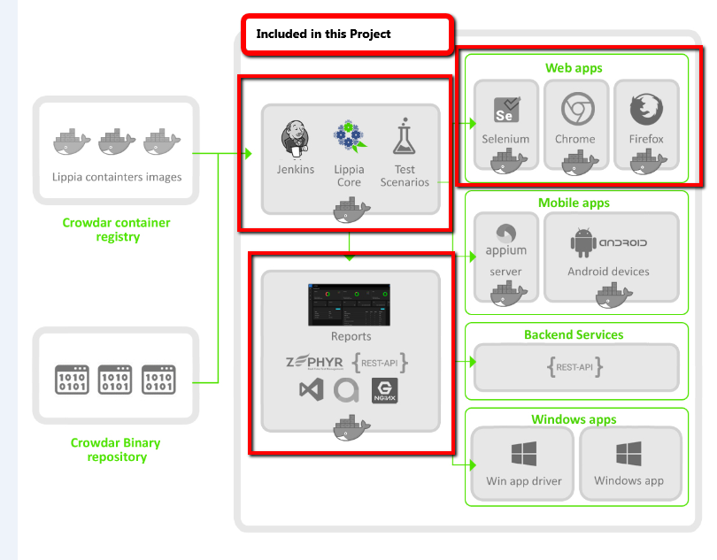

# Lippia Web sample project

This project has the intention of show in a practical way how to use Lippia Automation Framework to build automated tests using Gherkin and Page-Object pattern. This sample project includes the required components as binaries, docker containers and configuration files to simply download and run a set of sample tests in your local computer, using the Lippia container stack described bellow.

***


## Docker stack

The following project includes the basic Docker Lippia Containers to run this  web sample project. You can choose to run the code from your favourite IDE, run from console or from Jenkins using the Docker Stack.
To install and start a local instalation with Docker containers go to **Getting started** at the end of this guide. 



## Project structure

A typical Lippia Test Automation project usually looks like this 

```
	.
├── main
│   ├── java
│   │   └── com
│   │       └── crowdar
│   │           └── examples
│   │               ├── pages
│   │               │   ├── GoogleHomePage.java
│   │               │   ├── GoogleSearchResultPage.java
│   │               │   ├── PageBaseGoogle.java
│   │               └── steps
│   │                   └── GoogleSteps.java
│   └── resources
│       ├── config.properties
│       ├── cucumber.properties
│       └── webdrivermanager.properties
└── test
    ├── java
    │   ├── CrowdTestNgParallelRunner.java
    │   ├── CrowdTestNgRunner.java
    │   └── com
    │       └── crowdar
    │           └── Hooks.java
    └── resources
        └── features
            └── googleSearch.feature
```

Folder's description:

|Path   |Description    |
|-------|----------------|
|main\java\\...\examples\pages\\\*.java|Folder with all the **PageObjects** matching steps with java code|
|main\java\\...\examples\steps\\\*Steps.java|Folder with all the **steps** wich match with Gherkin Test Scenarios |
|test\resources\features\\\*.feature|Folder with all the **feature files** containing **Test Scenarios** and **Sample Data** |
|main\resources|Folder with all configuration needed to run Lippia |

In this example, *GoogleHomePage* is the first web page the framework will interact with. The **steps** defined in *GoogleSteps.java* to execute the *Test Scenarios* defined in Gherkin language. 


|File   | Description    |
|-------|----------------|
|PageBaseGoogle    | Define base URL to navigate. |
|GoogleHomePage.java   | PageObject: between each element in the webpage *GoogleHomePage* you want to interact with. You need to add one new file for each page you want to navigate in your tests. |
|GoogleSteps.java   | StepOpject: Code to support the behaviour of each **step** coded into the feature files for the *GoogleHomePage* web page. This code executes the interaction between the Framework and the web application and match the steps with the code who run interactions. |
|googleSearch.feature| Feature file: Definition of the **Test Scenarios** with all the **steps** written in Cucumber format (http)|

## Page base    
***
```
public class PageBaseGoogle extends CucumberPageBase {

    public PageBaseGoogle(SharedDriver driver){
        super( driver);
        BASE_URL = "http://www.google.com.ar";
    }
}
```


## Page Object    
***    
```
public class GoogleHomePage extends PageBaseGoogle{

    private WebElement googleInput(){return getWebElement(By.xpath("//input[@class='gLFyf gsfi']"));}
    private WebElement googleSearchBtn(){return getWebElement(By.name("btnK"));}

    public GoogleHomePage(SharedDriver driver){
        super(driver);
        this.url = ""; //here you can define the custom paths For example:"/search" --> www.googe.com/search
    }

    public void go(){
        navigateToIt();
    }

    public void enterSearchCriteria(String palabra){
        googleInput().clear();
        googleInput().sendKeys(palabra);
    }

    public void clickSearchButton(){
        googleSearchBtn().click();
    }

}
```

## Step Object   
***
    
```
public class GoogleSteps extends PageSteps {

    private GoogleHomePage homePage;
    private GoogleSearchResultPage searchResultPage;

    public GoogleSteps(SharedDriver driver){
        super(driver);
        homePage = new GoogleHomePage(driver);
        searchResultPage= new GoogleSearchResultPage(driver);
    }

    @Given("The client is in google page")
    public void home(){
    	homePage.go();
    }

    @When("The client search for word (.*)")
    public void search(String criteria){
    	homePage.enterSearchCriteria(criteria);
    	homePage.clickSearchButton();

    }

    @Then("The client verify that results are shown properly")
    public void statVerfication(){
    	Assert.assertTrue(!searchResultPage.getStats().isEmpty());
	
    }
}
```


## Feature File
***

The Test Scenarios can be written using BDD metodology. This project includes Cucumber as BDD interpreter which is supported by Lippia by default. On each declared step you can insert the calls defined from service classes            
    
```
Feature: As a potential client i need to search in google to find a web site

  @Smoke
  Scenario: The client search by "crowdar"
    Given The client is in google page
    When The client search for word crowdar
    Then The client verify that results are shown properly
    
  @Smoke
  Scenario: The client search by "automation"
    Given The client is in google page
    When The client search for word automation
    Then The client verify that results are shown properly
    
  @Smoke
  Scenario: The client search by "docker"
    Given The client is in google page
    When The client search for word docker
    Then The client verify that results are shown properly
	
  @Smoke
  Scenario: The client search by "vagrant"
    Given The client is in google page
    When The client search for word vagrant
    Then The client verify that results are shown properly
```

# Getting started
    
- If you are Linux user 
    [`Getting started - Linux User`](docs/README_Linux.md)
- If you are Windows user
    [`Getting started - Windows User`](docs/README_Windows.md)
    
    
"This project is licensed under the terms of the MIT license."


# Update Version Lippia 3

## Main Features: 
- Added multiple reports of extent reports
- Added the feature to handle the chrome options by a json file
- Include project type properties that allows to decide wich library would need for the project
- Added the dependency for lippia report server 
- Cucumber version updated


## Multiple reports templates:
 - With this version of Lippia the user have the possibility to choose which kind of template for html reports is the best for the project requirements.
   The user only need to turn on the flag in the extent.properties file located in src/test/resources.
   
   
### Some examples of this are
   
#### Avenstack template:
   ![aventstack_report] (https://bitbucket.org/crowdarautomation/lippia-web-sample-project/raw/91f94d530c4b87c88731a59e6285843926543b58/docs/img/aventstack_report.png)
   
#### BDD template:
   ![bbd_report] (https://bitbucket.org/crowdarautomation/lippia-web-sample-project/raw/91f94d530c4b87c88731a59e6285843926543b58/docs/img/bbd_report.png)
   
#### Cards template:
   ![cards_report] (https://bitbucket.org/crowdarautomation/lippia-web-sample-project/raw/91f94d530c4b87c88731a59e6285843926543b58/docs/img/cards_report.png)
   
## Chrome driver options file:   
 - Added the ability to set up the options for the chromedriver in order to have all of the properties setted. For example the user is allowed to set the headless value.

```
 {
  "browserName": "chrome",
  "goog:chromeOptions": {"args": ["disable-infobars","--headless","--window-size=1440x900", "--no-sandbox", "--disable-dev-shm-usage" , "--ignore-certificate-errors", "--start-maximized", "--user-agent=Mozilla/5.0 (Windows NT 10.0; Win64; x64) AppleWebKit/537.36 (KHTML, like Gecko) Chrome/83.0.4103.97 Safari/537.36"],
    "extensions": [],
    "prefs": {"printing.enabled": false}
  },
  "platform": "ANY",
  "recordVideo":"false"
}
```

Also as you can see in this file you can set up the record video property to get the evidence of the each flow in a video


## Project type options:
- The project type option allows the user to say Lippia which library would need to download. For this project is setted the WEB_CHROME one that uses the library for this webdriver.
  This option can be changed in the pom.xml file
  You can get more information checking the readme from lippia-core project.
  
  ProjectTypes for web project: 		

 	WEB_CHROME
        crowdar.projectType=WEB_CHROME
        crowdar.projectType.driverCapabilities.jsonFile=src/main/resources/browsers/chromeCapabilities.json
        crowdar.setupStrategy=web.DownloadLatestStrategy

 	WEB_FIREFOX
        crowdar.projectType=WEB_FIREFOX
        crowdar.projectType.driverCapabilities.jsonFile=src/main/resources/browsers/firefoxCapabilities.json
        crowdar.setupStrategy=web.DownloadLatestStrategy

 	WEB_EDGE
        crowdar.projectType=WEB_EDGE
        crowdar.projectType.driverCapabilities.jsonFile=src/main/resources/browsers/edgeCapabilities.json
        crowdar.setupStrategy=web.DownloadLatestStrategy

 	WEB_IE
        crowdar.projectType=WEB_IE
        crowdar.projectType.driverCapabilities.jsonFile=src/main/resources/browsers/ieCapabilities.json
        crowdar.setupStrategy=web.DownloadLatestStrategy

 	WEB_SAFARI
        crowdar.projectType=WEB_SAFARI
        crowdar.projectType.driverCapabilities.jsonFile=src/main/resources/browsers/safariCapabilities.json
        crowdar.setupStrategy=web.DownloadLatestStrategy 

